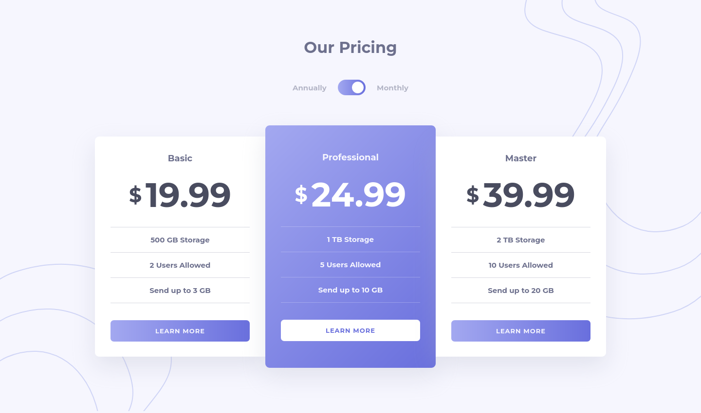

# Frontend Mentor - Pricing component with toggle solution

This is a solution to the [Pricing component with toggle challenge on Frontend Mentor](https://www.frontendmentor.io/challenges/pricing-component-with-toggle-8vPwRMIC). Frontend Mentor challenges help you improve your coding skills by building realistic projects. 

## Table of contents

- [Overview](#overview)
  - [Screenshot](#screenshot)
  - [Links](#links)
  - [Built with](#built-with)
  - [Continued development](#continued-development)
  - [Useful resources](#useful-resources)
- [Author](#author)


## Overview
This is a solution to the Pricing component with toggle challenge on Frontend Mentor developed using HTML, CSS and JS.

### Screenshot




### Links

- Solution URL: (https://github.com/ribikaY/pricing-with-toggle.git)
- Live Site URL:()

## My process

- First, I broke down the user interface into components. 

- After dividing the UI into components, I began working on the HTML structure. With the HTML structure in place, I assigned appropriate classes to the HTML elements.

- Then, I started working on the styling using CSS.

- After the UI was developed, I began working on making the toggle switch functional using JavaScript. Whenever the switch is changed, the pricing on the product card also updates.

- In the HTML, I assigned an ID to each of the pricing elements that change when the switch is checked. Additionally, I assigned an ID to the input checkbox, which serves as the switch, to keep track of its state.

- I added an event listener to detect changes in the switch's state. If the checkbox is checked (the switch is on), the prices on the card will change to the monthly prices. If the checkbox is unchecked, the prices will switch to the annual prices.

### Built with

- HTML
- CSS 
- JavaScript

### Continued development

I want to further improve my proficiency in Vanilla JavaScript. It's been a while since I've worked solely with JavaScript without any frameworks or libraries, and I believe there's always room for improvement.

### Useful resources

- [resource 1](https://www.w3schools.com/howto/howto_css_switch.asp) - This helped me create and style the toggle switch.

```

## Author

- Website - Ribika Yonas(https://ribika-portfolio.vercel.app/)
- Frontend Mentor - [@ribikaY](https://www.frontendmentor.io/profile/ribikaY)
